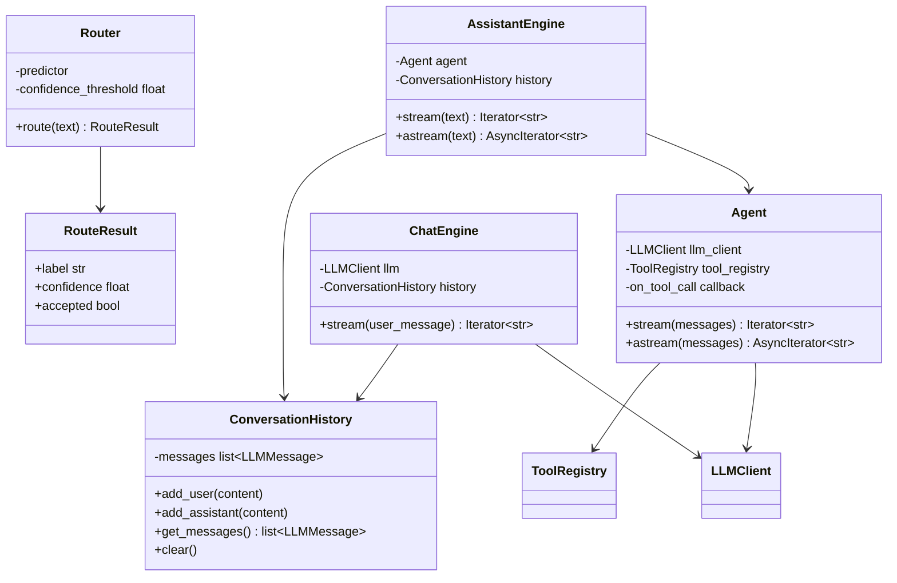
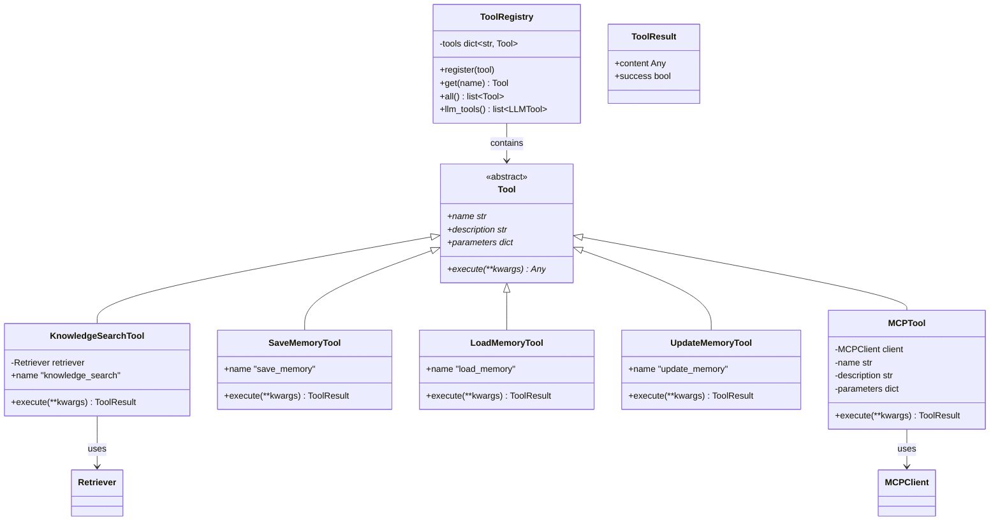
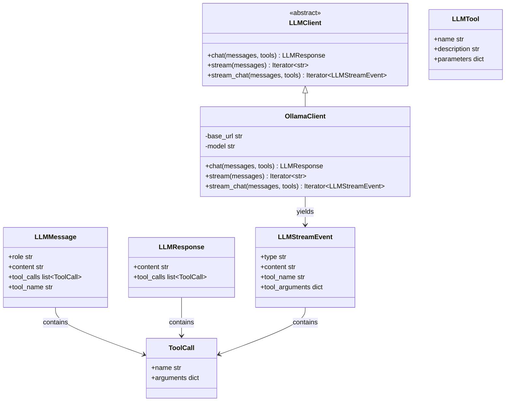
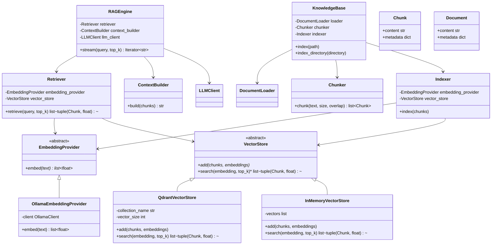
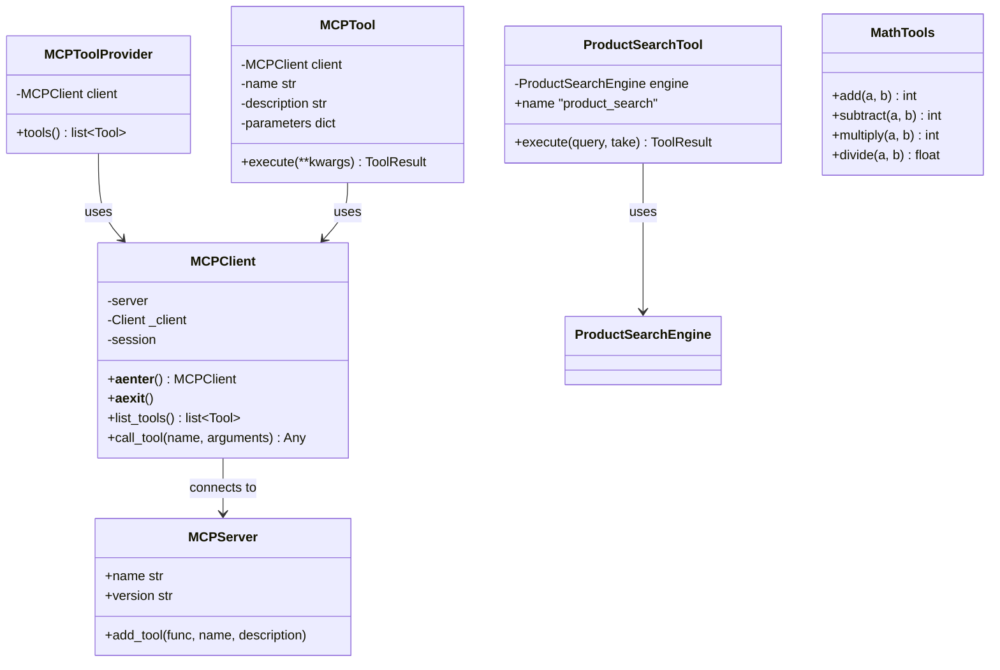
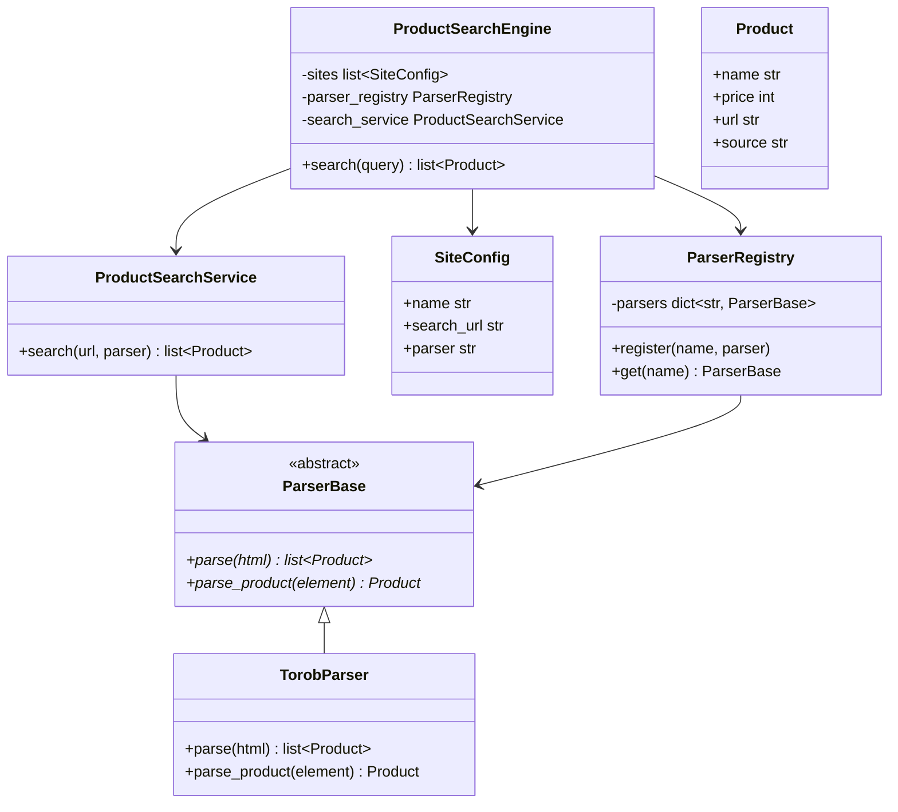
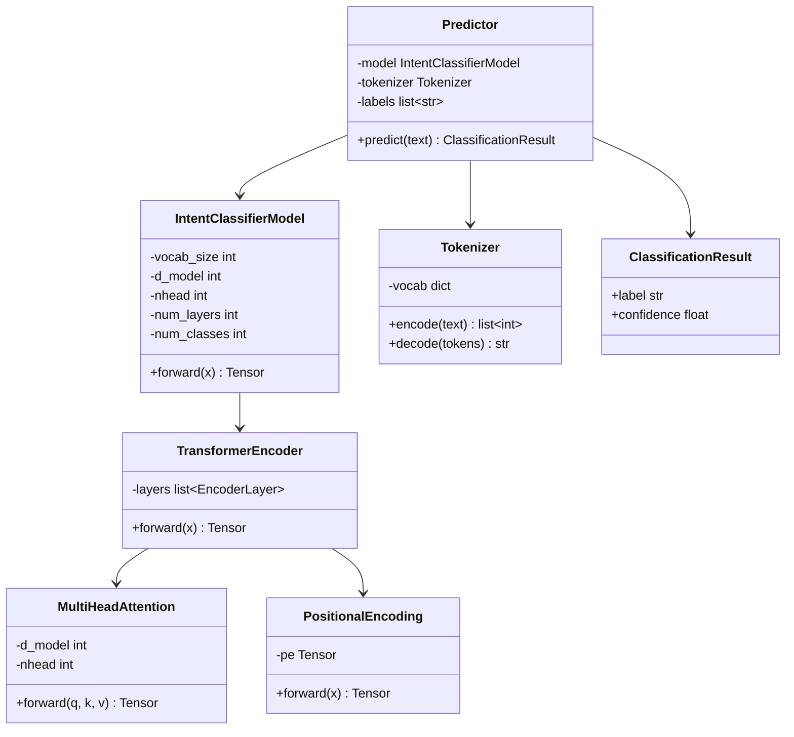
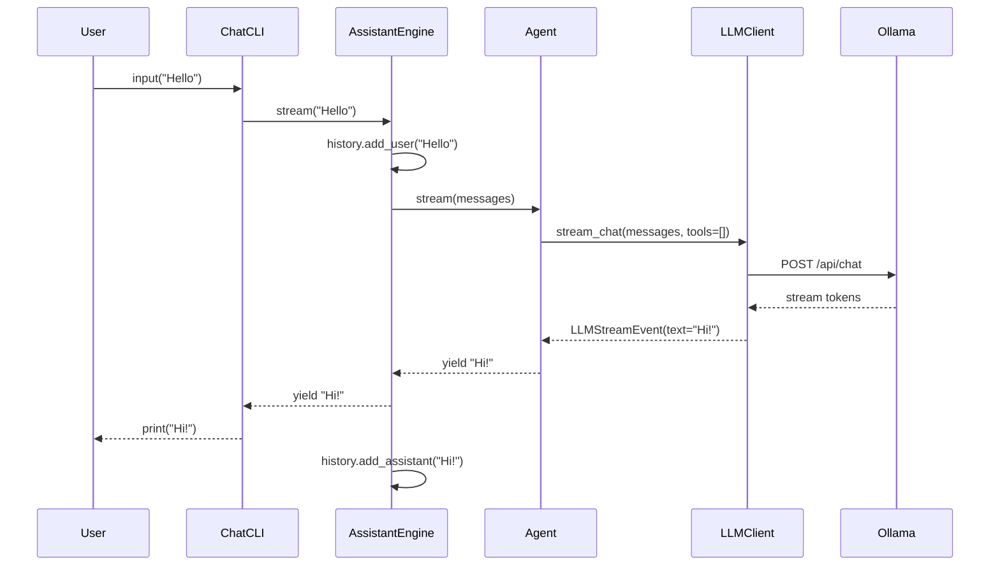
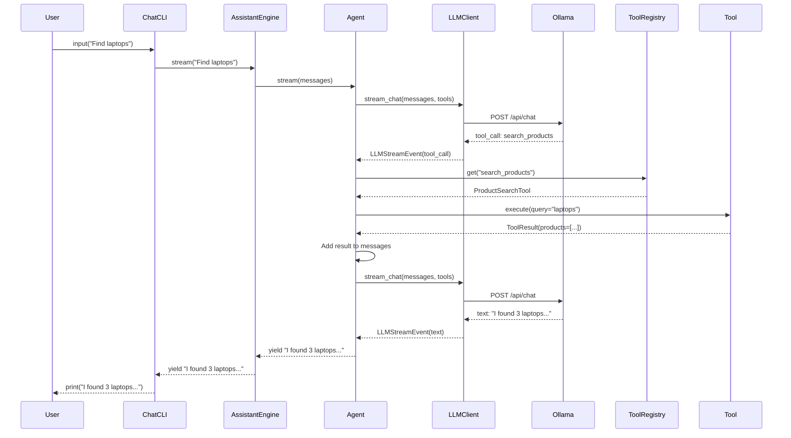
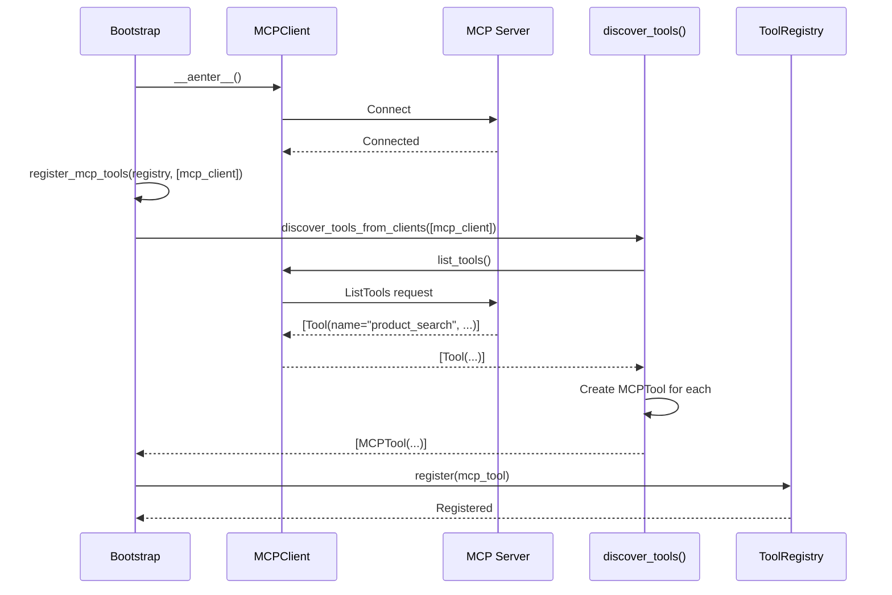

# Mini AI Assistant - Architecture Diagrams & Class Wiring

This document provides visual representations of the project's architecture, class relationships, data flow, and component wiring.

---

## Table of Contents

1. [High-Level Architecture](#high-level-architecture)
2. [Class Diagram](#class-diagram)
3. [Component Wiring](#component-wiring)
4. [Data Flow Diagrams](#data-flow-diagrams)
5. [Dependency Graph](#dependency-graph)
6. [Sequence Diagrams](#sequence-diagrams)

---

## High-Level Architecture

### Layered Architecture Overview

```
┌─────────────────────────────────────────────────────────────────────────────┐
│                         PRESENTATION LAYER                                   │
│  ┌───────────────────────────────────────────────────────────────────────┐  │
│  │  CLI (cli/chat/cli.py, cli/knowledge/cli.py)                          │  │
│  │  - ChatCLI: Interactive chat interface                                 │  │
│  │  - KnowledgeCLI: Document indexing interface                           │  │
│  └───────────────────────────────────────────────────────────────────────┘  │
├─────────────────────────────────────────────────────────────────────────────┤
│                         APPLICATION LAYER                                    │
│  ┌──────────────────┐  ┌──────────────────┐  ┌──────────────────────────┐  │
│  │ AssistantEngine  │  │     Agent        │  │      Router             │  │
│  │ (assistant/      │  │ (agent/          │  │ (router/                │  │
│  │  engine.py)      │  │  agent.py)       │  │  router.py)             │  │
│  │                  │  │                  │  │                         │  │
│  │ - Orchestrates   │  │ - ReAct loop     │  │ - Intent classification │  │
│  │ - Manages        │  │ - Tool calling   │  │ - Confidence routing    │  │
│  │   history        │  │ - Streaming      │  │ - Fallback handling     │  │
│  └──────────────────┘  └──────────────────┘  └──────────────────────────┘  │
├─────────────────────────────────────────────────────────────────────────────┤
│                         DOMAIN LAYER                                         │
│  ┌──────────────────┐  ┌──────────────────┐  ┌──────────────────────────┐  │
│  │ Tool (ABC)       │  │ ToolRegistry     │  │ ConversationHistory      │  │
│  │ (tools/          │  │ (tools/          │  │ (chat/                  │  │
│  │  base.py)        │  │  registry.py)    │  │  history.py)            │  │
│  │                  │  │                  │  │                         │  │
│  │ - name()         │  │ - register()     │  │ - add_user()            │  │
│  │ - description()  │  │ - get()          │  │ - add_assistant()       │  │
│  │ - parameters()   │  │ - all()          │  │ - get_messages()        │  │
│  │ - execute()      │  │ - llm_tools()    │  │ - clear()               │  │
│  └──────────────────┘  └──────────────────┘  └──────────────────────────┘  │
│                                                                              │
│  ┌──────────────────┐  ┌──────────────────┐  ┌──────────────────────────┐  │
│  │ ProductSearch    │  │ ProductSearch    │  │ ParserBase (ABC)         │  │
│  │ Engine           │  │ Service          │  │ (product_search/         │  │
│  │ (product_search/ │  │ (product_search/ │  │  parsers/base.py)        │  │
│  │  engine.py)      │  │  service.py)     │  │                          │  │
│  │                  │  │                  │  │ - parse()                │  │
│  │ - search()       │  │ - search()       │  │ - parse_product()        │  │
│  │ - Multi-site     │  │ - HTTP fetch     │  │                          │  │
│  └──────────────────┘  └──────────────────┘  └──────────────────────────┘  │
├─────────────────────────────────────────────────────────────────────────────┤
│                      INFRASTRUCTURE LAYER                                    │
│  ┌──────────────────┐  ┌──────────────────┐  ┌──────────────────────────┐  │
│  │ LLMClient (ABC)  │  │ OllamaClient     │  │ MCPClient                │  │
│  │ (llm/            │  │ (llm/            │  │ (mcp/client/             │  │
│  │  client.py)      │  │  ollama_client.py│  │  client.py)              │  │
│  │                  │  │                  │  │                          │  │
│  │ - chat()         │  │ - stream_chat()  │  │ - list_tools()           │  │
│  │ - stream()       │  │ - Ollama API     │  │ - call_tool()            │  │
│  │ - stream_chat()  │  │ - Streaming      │  │ - Async context manager  │  │
│  └──────────────────┘  └──────────────────┘  └──────────────────────────┘  │
│                                                                              │
│  ┌──────────────────┐  ┌──────────────────┐  ┌──────────────────────────┐  │
│  │ VectorStore      │  │ QdrantVectorStore│  │ EmbeddingProvider        │  │
│  │ (ABC)            │  │ (rag/            │  │ (ABC)                    │  │
│  │ (rag/            │  │  qdrant_vector_  │  │ (rag/                    │  │
│  │  vector_store.py)│  │  store.py)       │  │  embedding.py)           │  │
│  │                  │  │                  │  │                          │  │
│  │ - add()          │  │ - Qdrant DB      │  │ - embed()                │  │
│  │ - search()       │  │ - Collection mgmt│  │                          │  │
│  └──────────────────┘  └──────────────────┘  └──────────────────────────┘  │
│                                                                              │
│  ┌──────────────────┐  ┌──────────────────┐  ┌──────────────────────────┐  │
│  │ ParserRegistry   │  │ HttpxFetcher     │  │ DocumentLoader           │  │
│  │ (product_search/ │  │ (product_search/ │  │ (rag/                    │  │
│  │  parsers/        │  │  fetcher.py)     │  │  loader.py)              │  │
│  │  registry.py)    │  │                  │  │                          │  │
│  │                  │  │ - HTTP GET       │  │ - load()                 │  │
│  │ - register()     │  │ - HTML fetch     │  │ - File reading           │  │
│  │ - get()          │  │                  │  │                          │  │
│  └──────────────────┘  └──────────────────┘  └──────────────────────────┘  │
├─────────────────────────────────────────────────────────────────────────────┤
│                         ML/AI LAYER                                          │
│  ┌───────────────────────────────────────────────────────────────────────┐  │
│  │  Intent Classifier (intent_classifier/)                                │  │
│  │  - Custom Transformer model                                            │  │
│  │  - Tokenizer, Encoder, Attention, Pooling                              │  │
│  │  - Predictor for inference                                             │  │
│  └───────────────────────────────────────────────────────────────────────┘  │
│                                                                              │
│  ┌───────────────────────────────────────────────────────────────────────┐  │
│  │  OllamaEmbeddingProvider (rag/ollama_embedding.py)                     │  │
│  │  - Generates embeddings via Ollama                                     │  │
│  └───────────────────────────────────────────────────────────────────────┘  │
└─────────────────────────────────────────────────────────────────────────────┘
```

---

## Class Diagram

### Core Application Classes



### Tool System Classes



### LLM & Message Classes



### RAG System Classes



### MCP System Classes



### Product Search Classes



### Intent Classifier Classes



---

## Component Wiring

### Bootstrap / Composition Root

The [`application/bootstrap.py`](application/bootstrap.py) file is the **composition root** that wires all components together:

```python
# application/bootstrap.py - create_assistant()
async def create_assistant(llm_client, mcp_client) -> AssistantEngine:
    # 1. Create embedding provider
    embedding_provider = OllamaEmbeddingProvider(client=llm_client)

    # 2. Create vector store
    vector_store = QdrantVectorStore(collection_name="mini_chat_collection", vector_size=4096)

    # 3. Create retriever
    retriever = Retriever(embedding_provider=embedding_provider, vector_store=vector_store)

    # 4. Create knowledge search tool
    knowledge_search_tool = KnowledgeSearchTool(retriever=retriever)

    # 5. Create memory tools
    save_memory_tool = SaveMemoryTool()
    load_memory_tool = LoadMemoryTool()
    update_memory_tool = UpdateMemoryTool()

    # 6. Register all tools
    tool_registry = ToolRegistry()
    tool_registry.register(knowledge_search_tool)
    tool_registry.register(save_memory_tool)
    tool_registry.register(load_memory_tool)
    tool_registry.register(update_memory_tool)

    # 7. Register MCP tools dynamically
    await register_mcp_tools(registry=tool_registry, clients=[mcp_client])

    # 8. Create agent
    agent = Agent(llm_client=llm_client, tool_registry=tool_registry)

    # 9. Return assistant engine
    return AssistantEngine(agent=agent, history=ConversationHistory())
```

### Wiring Diagram

```
┌─────────────────────────────────────────────────────────────────────────────┐
│                         COMPOSITION ROOT (bootstrap.py)                      │
└─────────────────────────────────────────────────────────────────────────────┘
                                    │
        ┌───────────────────────────┼───────────────────────────┐
        │                           │                           │
        ▼                           ▼                           ▼
┌───────────────┐           ┌───────────────┐           ┌───────────────┐
│ OllamaClient  │           │ MCPClient     │           │ ToolRegistry  │
│ (LLM)         │           │ (External)    │           │               │
└───────┬───────┘           └───────┬───────┘           └───────┬───────┘
        │                           │                           │
        │                           │                           │
        ▼                           ▼                           ▼
┌───────────────┐           ┌───────────────┐           ┌───────────────┐
│ OllamaEmbedding│           │ MCP Tools     │           │ KnowledgeSearch│
│ Provider      │           │ (discovered)  │           │ Tool          │
└───────┬───────┘           └───────────────┘           └───────┬───────┘
        │                                                       │
        │                                                       │
        ▼                                                       ▼
┌───────────────┐           ┌───────────────┐           ┌───────────────┐
│ QdrantVector  │           │ SaveMemory    │           │ Retriever     │
│ Store         │           │ Tool          │           │               │
└───────┬───────┘           └───────┬───────┘           └───────┬───────┘
        │                           │                           │
        │                           │                           │
        └───────────────────────────┼───────────────────────────┘
                                    │
                                    ▼
                        ┌───────────────────────┐
                        │      Agent            │
                        │  (ReAct Loop)         │
                        └───────────┬───────────┘
                                    │
                                    ▼
                        ┌───────────────────────┐
                        │  AssistantEngine      │
                        │  (Orchestration)      │
                        └───────────┬───────────┘
                                    │
                                    ▼
                        ┌───────────────────────┐
                        │   ChatCLI             │
                        │   (Presentation)      │
                        └───────────────────────┘
```

### Agent Tool Loop Wiring

```
┌─────────────────────────────────────────────────────────────────────────────┐
│                              AGENT TOOL LOOP                                  │
└─────────────────────────────────────────────────────────────────────────────┘

    ┌─────────────┐
    │   Agent     │
    │             │
    │ 1. Receives │
    │    messages │
    └──────┬──────┘
           │
           ▼
    ┌─────────────┐
    │ LLMClient   │
    │             │
    │ 2. Calls    │
    │ stream_chat │
    │ (with tools)│
    └──────┬──────┘
           │
           ▼
    ┌─────────────┐
    │   Ollama    │
    │   API       │
    │             │
    │ 3. Returns  │
    │   events    │
    └──────┬──────┘
           │
           ▼
    ┌─────────────┐
    │   Agent     │
    │             │
    │ 4. Processes│
    │   events    │
    │             │
    │ - text?     │───► Yield to user
    │ - tool_call?│
    └──────┬──────┘
           │
           ▼ (if tool_call)
    ┌─────────────┐
    │ ToolRegistry│
    │             │
    │ 5. Looks up │
    │    tool     │
    └──────┬──────┘
           │
           ▼
    ┌─────────────┐
    │   Tool      │
    │             │
    │ 6. Executes │
    │   execute() │
    └──────┬──────┘
           │
           ▼
    ┌─────────────┐
    │   Agent     │
    │             │
    │ 7. Adds     │
    │   result to │
    │   history   │
    └──────┬──────┘
           │
           ▼
    ┌─────────────┐
    │ LLMClient   │
    │             │
    │ 8. Calls    │
    │ stream_chat │
    │ (again)     │
    └──────┬──────┘
           │
           ▼
    ┌─────────────┐
    │   Agent     │
    │             │
    │ 9. Yields   │
    │   final     │
    │   response  │
    └─────────────┘
```

---

## Data Flow Diagrams

### Complete Request Flow (Chat with Tool Calling)

```
┌─────────────────────────────────────────────────────────────────────────────┐
│                         COMPLETE REQUEST FLOW                                 │
└─────────────────────────────────────────────────────────────────────────────┘

    User Input
        │
        ▼
    ┌─────────────┐
    │   ChatCLI   │
    │             │
    │ - Reads     │
    │   input     │
    │ - Calls     │
    │   engine    │
    │   .stream() │
    └──────┬──────┘
           │
           ▼
    ┌─────────────────┐
    │ AssistantEngine │
    │                 │
    │ - Adds user     │
    │   message to    │
    │   history       │
    │ - Gets messages │
    │ - Calls agent   │
    │   .stream()     │
    └──────┬──────────┘
           │
           ▼
    ┌─────────────────┐
    │      Agent      │
    │                 │
    │ - Copies        │
    │   messages      │
    │ - Enters loop:  │
    │   LLM → Tools   │
    │   → LLM → ...   │
    └──────┬──────────┘
           │
           ▼
    ┌─────────────────┐
    │   LLMClient     │
    │                 │
    │ - Calls         │
    │   stream_chat() │
    │ - Yields        │
    │   LLMStreamEvent│
    └──────┬──────────┘
           │
           ▼
    ┌─────────────────┐
    │     Ollama      │
    │                 │
    │ - Receives      │
    │   messages +    │
    │   tools         │
    │ - Streams       │
    │   response      │
    └──────┬──────────┘
           │
           ▼
    ┌─────────────────┐
    │      Agent      │
    │                 │
    │ - Collects      │
    │   tool_calls    │
    │ - If tool_call: │
    │   a. Execute    │
    │   b. Add result │
    │   c. Call LLM   │
    │   again         │
    │ - If no tools:  │
    │   Yield text    │
    └──────┬──────────┘
           │
           ▼
    ┌─────────────────┐
    │ AssistantEngine │
    │                 │
    │ - Collects      │
    │   response      │
    │ - Adds to       │
    │   history       │
    └──────┬──────────┘
           │
           ▼
    ┌─────────────────┐
    │     ChatCLI     │
    │                 │
    │ - Prints        │
    │   tokens        │
    │ - Shows tool    │
    │   call status   │
    └─────────────────┘
```

### RAG Data Flow

```
┌─────────────────────────────────────────────────────────────────────────────┐
│                         RAG DATA FLOW                                        │
└─────────────────────────────────────────────────────────────────────────────┘

    DOCUMENT INDEXING:
    ─────────────────
    Document File
        │
        ▼
    DocumentLoader.load()
        │
        ▼
    Chunker.chunk() ──► list[Chunk]
        │
        ▼
    OllamaEmbeddingProvider.embed() ──► list[list[float]]
        │
        ▼
    QdrantVectorStore.add() ──► Stored in Qdrant

    QUERY PROCESSING:
    ─────────────────
    User Query: "What is the return policy?"
        │
        ▼
    Retriever.retrieve()
        │
        ├─► OllamaEmbeddingProvider.embed(query) ──► [0.123, -0.456, ...]
        │
        ▼
    QdrantVectorStore.search(embedding, top_k=3)
        │
        ▼
    list[(Chunk, score), ...]
        │
        ▼
    ContextBuilder.build(chunks)
        │
        ▼
    "Context: Returns accepted within 30 days...\nQuestion: What is the return policy?"
        │
        ▼
    LLMClient.stream(messages) ──► "According to our policy..."
```

### MCP Tool Discovery Flow

```
┌─────────────────────────────────────────────────────────────────────────────┐
│                         MCP TOOL DISCOVERY                                    │
└─────────────────────────────────────────────────────────────────────────────┘

    MCPClient (connected to server)
        │
        ▼
    client.list_tools()
        │
        ▼
    MCP Server returns: [Tool(name="product_search", ...), ...]
        │
        ▼
    discover_tools_from_clients()
        │
        ▼
    For each tool:
        │
        ▼
    MCPTool(client, name, description, input_schema)
        │
        ▼
    ToolRegistry.register(MCPTool)
        │
        ▼
    Agent can now call MCP tools via tool_registry.get("product_search")
```

---

## Dependency Graph

### Module Dependencies

```
┌─────────────────────────────────────────────────────────────────────────────┐
│                         DEPENDENCY DIRECTION                                  │
│  (Arrows point from dependent to dependency)                                 │
└─────────────────────────────────────────────────────────────────────────────┘

    cli/chat/cli.py
        │
        ▼
    application/assistant/engine.py
        │
        ├──────────────────────┐
        ▼                      ▼
    application/agent/       application/router/
    agent.py                 router.py
        │                      │
        ▼                      ▼
    application/llm/         intent_classifier/
    ollama_client.py         predictor.py
        │
        ├──────────────────────┐
        ▼                      ▼
    application/tools/       application/rag/
    registry.py              retriever.py
        │                      │
        ▼                      ▼
    application/tools/       application/rag/
    base.py                  qdrant_vector_store.py
        │                      │
        │                      ▼
        │               application/rag/
        │               ollama_embedding.py
        │
        ▼
    application/llm/
    client.py (ABC)
        │
        ▼
    application/llm/
    ollama_client.py
        │
        ▼
    ollama (external)
```

### Internal Dependency Graph

```
┌─────────────────────────────────────────────────────────────────────────────┐
│                         INTERNAL DEPENDENCY GRAPH                             │
└─────────────────────────────────────────────────────────────────────────────┘

    application/bootstrap.py
        ├── application/agent/agent.py
        │       ├── application/llm/client.py
        │       └── application/tools/registry.py
        │           └── application/tools/base.py
        ├── application/assistant/engine.py
        │       ├── application/agent/agent.py
        │       └── application/chat/history.py
        ├── application/rag/ollama_embedding.py
        │       └── application/llm/ollama_client.py
        ├── application/rag/qdrant_vector_store.py
        ├── application/rag/retriever.py
        │       ├── application/rag/embedding.py
        │       └── application/rag/vector_store.py
        ├── application/tools/knowledge_search.py
        │       └── application/rag/retriever.py
        ├── application/tools/save_memory.py
        ├── application/tools/load_memory.py
        ├── application/tools/update_memory.py
        ├── application/tools/bootstrap.py
        │       ├── application/mcp/client/client.py
        │       └── application/mcp/tools.py
        │           └── application/tools/mcp_tool.py
        └── application/chat/history.py
                └── application/llm/message.py
```

---

## Sequence Diagrams

### Simple Chat Sequence



### Tool Calling Sequence



### MCP Tool Discovery Sequence



---

## Key Design Patterns Visualized

### 1. Dependency Injection

```
┌─────────────────────────────────────────────────────────────────────────────┐
│                    DEPENDENCY INJECTION PATTERN                               │
└─────────────────────────────────────────────────────────────────────────────┘

    ┌─────────────┐
    │   Agent     │
    │             │
    │  ┌────────┐ │
    │  │ LLM    │ │  ◄── Injected via constructor
    │  │ Client │ │
    │  └────────┘ │
    │             │
    │  ┌────────┐ │
    │  │ Tool   │ │  ◄── Injected via constructor
    │  │Registry│ │
    │  └────────┘ │
    └─────────────┘

    Benefits:
    - Easy testing (mock dependencies)
    - Flexible configuration
    - Clear dependency graph
```

### 2. Registry Pattern

```
┌─────────────────────────────────────────────────────────────────────────────┐
│                         REGISTRY PATTERN                                      │
└─────────────────────────────────────────────────────────────────────────────┘

    ┌─────────────┐
    │  Registry   │
    │             │
    │  ┌───────┐  │
    │  │Tool 1 │  │
    │  ├───────┤  │
    │  │Tool 2 │  │
    │  ├───────┤  │
    │  │Tool 3 │  │
    │  ├───────┤  │
    │  │MCP    │  │  ◄── Dynamically discovered
    │  │Tool   │  │
    │  └───────┘  │
    └──────┬──────┘
           │
           │ get("tool_name")
           ▼
    ┌─────────────┐
    │     Tool    │
    └─────────────┘

    Benefits:
    - Dynamic discovery
    - Plugin architecture
    - Decoupled registration
```

### 3. Strategy Pattern (Router)

```
┌─────────────────────────────────────────────────────────────────────────────┐
│                         STRATEGY PATTERN                                      │
└─────────────────────────────────────────────────────────────────────────────┘

    ┌─────────────┐
    │   Router    │
    │             │
    │  ┌───────┐  │
    │  │Intent │  │
    │  │Classi-│  │
    │  │fier   │  │
    │  └───────┘  │
    │      │      │
    │      ▼      │
    │  ┌───────┐  │
    │  │Route  │  │
    │  │Result │  │
    │  └───────┘  │
    │      │      │
    │      ▼      │
    │  ┌───────┐  │
    │  │Handler│  │  ◄── Different strategies for different intents
    │  │(strategy)│ │
    │  └───────┘  │
    └─────────────┘

    Strategies:
    - search_product → ProductSearchTool
    - ask_knowledge → KnowledgeSearchTool
    - chat → Direct LLM response
```

### 4. Adapter Pattern (MCP Tool)

```
┌─────────────────────────────────────────────────────────────────────────────┐
│                         ADAPTER PATTERN                                       │
└─────────────────────────────────────────────────────────────────────────────┘

    ┌─────────────────┐         ┌─────────────────┐
    │  Internal Tool  │         │   MCP Tool      │
    │  Interface      │         │   Interface     │
    │                 │         │                 │
    │  + name()       │         │  + name         │
    │  + description()│         │  + description  │
    │  + parameters() │         │  + input_schema │
    │  + execute()    │         │  + call_tool()  │
    └────────┬────────┘         └────────┬────────┘
             │                            │
             │    ┌───────────────────────┘
             │    │
             ▼    ▼
    ┌─────────────────┐
    │   MCPTool       │  ◄── Adapter
    │                 │
    │  Wraps MCP      │
    │  client calls  │
    │  to match       │
    │  internal Tool  │
    │  interface      │
    └─────────────────┘
```

---

## Summary

This architecture demonstrates:

1. **Clean Layered Architecture** - 5 distinct layers with clear responsibilities
2. **Dependency Injection** - All dependencies injected via constructors
3. **Abstract Base Classes** - Multiple ABCs defining contracts (LLMClient, Tool, VectorStore, etc.)
4. **Registry Pattern** - Dynamic tool and parser discovery
5. **Strategy Pattern** - Intent-based routing with different handlers
6. **Adapter Pattern** - MCP tools adapted to internal Tool interface
7. **Factory Pattern** - Bootstrap functions as composition roots
8. **ReAct Pattern** - Agent implements Reason + Act loop for tool calling

The wiring ensures:
- **Testability** - All components can be mocked independently
- **Extensibility** - New tools, parsers, and LLM providers can be added without modifying core logic
- **Maintainability** - Changes in one layer don't cascade to others
- **Separation of Concerns** - Each layer has a single responsibility
